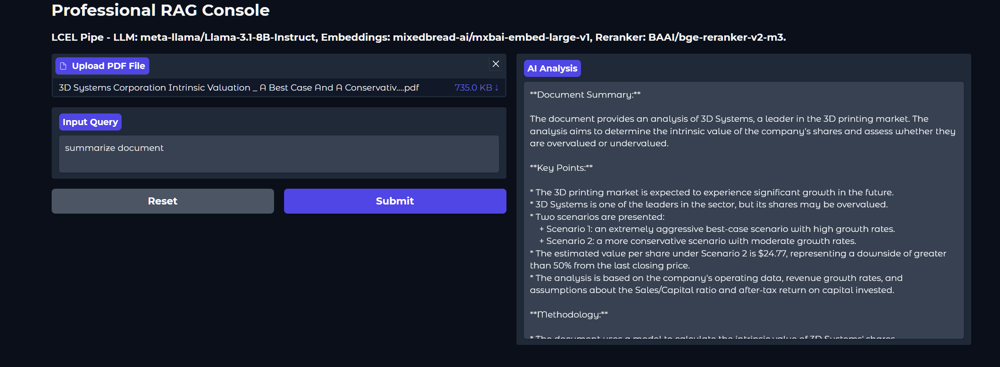

# 🤖 Hybrid Research Q&A Bot: Watsonx & Hugging Face

### *Dual-Engine Retrieval-Augmented Generation (RAG)*


*Figure 1: High-fidelity RAG pipeline featuring Multi-Tenant Isolation and Semantic Reranking.*

---

## 📋 Project Objective
This project features a sophisticated Research Q&A system capable of running on two distinct backends. It automates information extraction from complex technical and financial PDFs, providing precise, context-grounded answers.

- **Watsonx Version:** Designed for enterprise-grade performance, security, and governed AI using IBM's latest models.
- **Hugging Face Version:** Designed for open-source flexibility and local/cloud execution using the latest community models.

---

## 🏗️ System Architecture
Both versions share a modular **Retrieval-Augmented Generation (RAG)** architecture with advanced features:

**🔄 The Dual-Pipeline Strategy**
1. **Multi-Tenant Document Isolation:** Uses unique collection IDs (based on file hashes) to ensure zero data "cross-talk" when switching between different PDFs.
2. **Contextual Grounding (Granite-4 Optimized):** Utilizes specialized XML <documents> tagging to maximize the model's focus on retrieved content.
3. **Semantic Reranking:** Implements a two-stage retrieval process where a Cross-Encoder reranker prioritizes the most relevant data chunks from an initial pool of 30 candidates.
4. **Deterministic Generation:** Configured with low temperature and greedy decoding for technical accuracy and the elimination of "hallucinations."


*Figure 2: User interface showing PDF upload and context-grounded chat interaction.*

---

## 🚀 Key Features

- **Smart Chunking:** Recursive splitting (800/200 overlap) to preserve technical context.
- **Persistence:** ChromaDB vector storage with automatic hash-based index recovery.
- **Clean UI:** Gradio-powered research terminal with real-time analysis progress bars.
- **Robustness:** Built-in Windows file-lock handlers and automatic memory/garbage collection management.

---

## ⚙️ Execution Guide

### 1. Clone the repository
```bash
git clone https://github.com/fvalerii/qa-bot-langchain-rag.git
cd qa-bot-langchain-rag/apps
```

### 2. Set-up Credential
All application scripts and configuration templates are located in the /apps directory.

1. Locate the `.env` file in the `/apps` folder.

2. Fill in your token keys:
```bash
# Watsonx Config
WATSONX_API_KEY=your_ibm_api_key
PROJECT_ID=your_project_id
WATSONX_URL=https://us-south.ml.cloud.ibm.com

# Hugging Face Config
HF_TOKEN=your_huggingface_token
```

### 3. Run the Application
This project uses `uv` for simplified and accelerated dependency management. Both versions can be launched directly without manual environment setup:

```bash
# Launch the Enterprise Watsonx Edition
uv run qabot_watsonx.py
```
or

```bash
# Launch the Open-Source Hugging Face Edition
uv run qabot_huggingface.py
```

---

## 🛠️ System Operations & Maintenance

### **The Reset Functionality**
Both versions of the QABot include a **"Reset"** button in the Gradio interface to ensure a clean state for new analyses.

- **Watsonx Version (ChromaDB):** Clicking **Reset** clears the `vectordb` reference, forces garbage collection to release Windows file locks, and **permanently deletes** the `chroma_db_watsonx` directory and the `pdf.hash file`.
- **Hugging Face Version (FAISS):** Clicking **Reset** immediately **deletes the in-memory FAISS index**  and any local index files, allowing for a fresh document ingestion without metadata overlap.
**Note:** Use the Reset button whenever you wish to switch to a completely different research topic or clear the persistent storage on your machine.

---

## 💻 Tech Stack

### 🏢 Version A: Enterprise Watsonx (LTS)
Optimized for the 2026 IBM ecosystem with persistent metadata.

- **LLM:** `ibm/granite-4-h-small` (High-efficiency reasoning) 
- **Embeddings:** `ibm/slate-125m-english-rtrvr-v2` 
- **Reranker:** `WatsonxRerank` (via `ms-marco-minilm-l-12-v2`)
- **Vector Database:** **ChromaDB** (Persistent storage with automatic recovery)
- **Environment:** Managed via IBM Cloud/Watsonx.ai 


### 🏠 Version B: Open-Source Hugging Face
Optimized for flexibility and community model benchmarking.

- **LLM:** `Llama-3.1-8B-Instruct`
- **Embeddings:** `mixedbread-ai/mxbai-embed-large-v1`
- **Reranker:** `FlagReranker BAAI/bge-reranker-v2-m3`
- **Vector Database:** **FAISS** (Optimized for high-speed in-memory similarity search)
- **Environment:** Hugging Face Inference Endpoints.

---

##  Credits
Designed for high-fidelity research and industrial document analysis. Implementation focused on scalable, secure, and governed AI solutions.